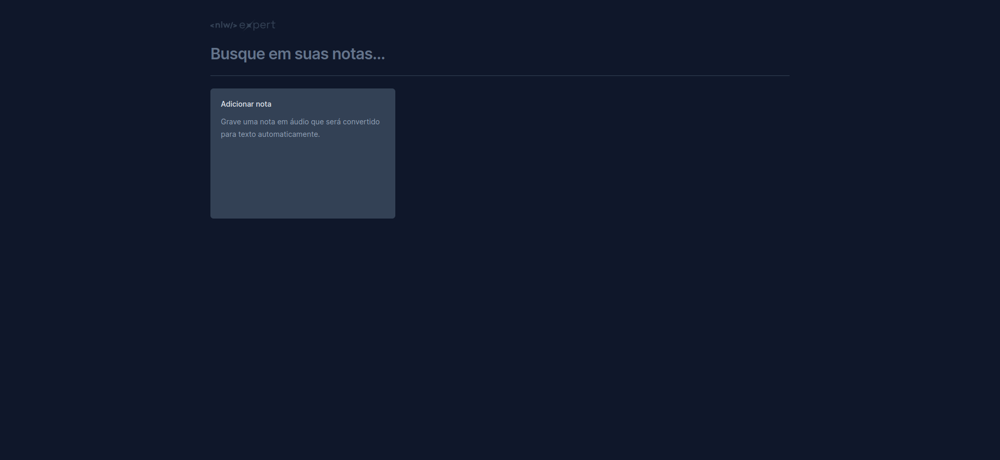

# NLW Expert (React)

## 💻 Sobre o projeto

Essa aplicação foi desenvolvida durante o NLW Experts para a trilha de React da Rocketseat utilizando React, TypeScript, Tailwind e a SpeechRecognition API.

## 🚀 Como executar o projeto

Após clonar o repositório, acesse a pasta do projeto e execute os comandos abaixo:

```sh
npm install
npm run dev
```
Acesse http://localhost:5173 para visualizar a aplicação.

### Tecnologias utilizadas

Na trilha do React foram usadas bibliotecas que facilitaram o desenvolvimento da aplicação.Além do Tailwind CSS, tivemos as outras duas que são o [Sonner](https://sonner.emilkowal.ski/) , que é uma biblioteca de Toast para React, como também o [Radix UI](https://www.radix-ui.com/) que é uma biblioteca de componentes para otimizar o desenvolvimento, facilitar a manutenção e a acessibilidade também.